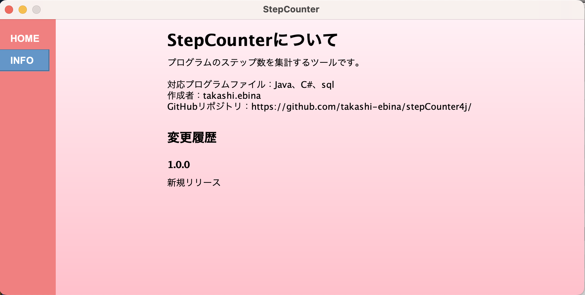

# 画面設計書　インフォメーション画面
## 画面概要
stepCounterの情報を出力するインフォメーション画面です

## 画面レイアウト
### インフォメーション画面

## 画面項目
|NO|項目名称|取得元|種別|繰り返し|型|表示形式|桁最小|桁最大|必須項目|ソート|初期値|備考|
|:----|:----|:----|:----|:----|:----|:----|:----|:----|:----|:----|:----|:----|
|1|インフォメーション欄|-|表示ラベル（LB）|-|-|-|-|-|-|-|-|本コンポーネントはHTMLで記述される。 swing APIの仕様により、HTML 3.2に準拠している。[参考URL](https://www.w3.org/TR/2018/SPSD-html32-20180315/)|

## 画面項目（表示制御）
なし

## 画面イベント
なし

## 入力値チェック
なし

## 処理詳細
なし

## テーブル仕様
なし