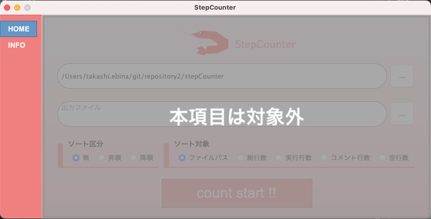

# 画面設計書　メニュー
## 画面概要
パネルの項目を切り替えるためのメニューです

## 画面レイアウト
### メニュー

## 画面項目
|NO|項目名称|取得元|種別|繰り返し|型|表示形式|桁最小|桁最大|必須項目|ソート|初期値|備考|
|:----|:----|:----|:----|:----|:----|:----|:----|:----|:----|:----|:----|:----|
|1|HOME|-|画面内タブ（TAB）|-|-|-|-|-|-|-|-|-|
|2|INFO|-|画面内タブ（TAB）|-|-|-|-|-|-|-|-|-|

## 画面項目（表示制御）
### パターン１　初期表示、HOME・INFOタブ押下時
|項目名称／表示制御|HOME|INFO|
|:----|:----|:----|
|表示／非表示|○|○|
|活性／非活性|○|○|

## 画面イベント
|NO|項目名称|イベント|処理概要|処理詳細|
|:----|:----|:----|:----|:----|
|1|HOME|クリック|ホーム画面を表示する| |
|2|INFO|クリック|インフォメーション画面を表示する| |

## 入力値チェック
なし

## 処理詳細
なし

## テーブル仕様
なし